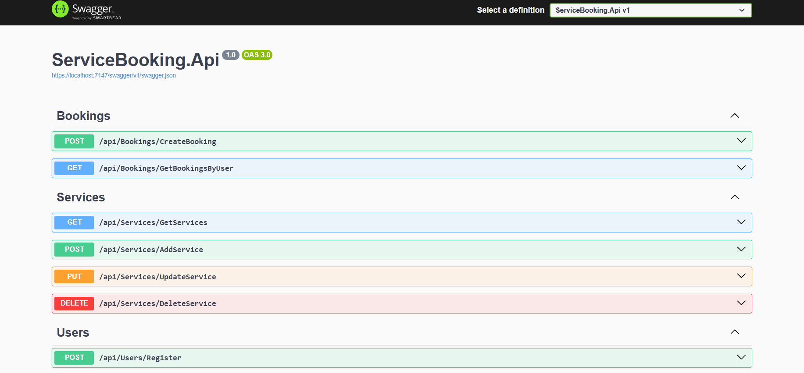

# Service Booking & Management System (Backend)

A RESTful Web API built with ASP.NET Core for managing services, users, and bookings.
This project simulates a real-world service booking system used by businesses such as
clinics, salons, and service providers.

## Features
- User registration and login
- Service management (CRUD)
- Booking services
- SQL Server database integration
- Clean architecture using DTOs
- Validation and error handling
- Swagger API documentation

## Tech Stack
- ASP.NET Core Web API
- Entity Framework Core
- SQL Server
- C#
- Swagger (OpenAPI)

## Project Structure
ServiceBooking.Api
├── Controllers
├── Models
├── DTOs
├── Data
├──Program.cs

## How to Run the Project
1. Clone the repository
2. Open the solution in Visual Studio
3. Update the connection string in `appsettings.json`
4. Run the project
5. Access Swagger UI from the browser

## API Endpoints (Examples)
- POST /api/users/register
- POST /api/users/login
- GET /api/services
- POST /api/services
- POST /api/bookings
- GET /api/bookings/user/{userId}

## Notes
- This project was built for learning and portfolio purposes.
- Authentication is implemented in a simple form (no JWT).
- 
## Screenshots

## Author
**Leen Al Jabali**  
Software Engineer | Flutter & Full Stack Mobile Applications Developer
